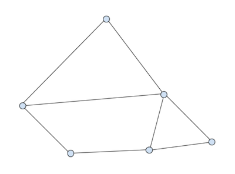

Higharc Computational Geometry Engineer Challenge PART 1
========================================================

Thank you for taking the time to complete Higharc’s Computational Geometry Engineering Challenge. We hope you can use
this as an opportunity to showcase your technical skills.

This is the first part of a two-part challenge.

## Background

You’re given a set of vertices connected by edges in the plane. The edges do not intersect except at their endpoints.
Together, they form a collection of closed polygons. The edges form a connected component. Here’s an example with 6
vertices and 8 edges:



This data structure is provided in the form of a collection of vertex positions and an edge set. Here’s an example that
defines a 2x2 rectangle with a diagonal interior edge:

```json
{										
"vertices": [[0, 0], [2, 0], [2, 2], [0, 2]],		
"edges": [[0, 1], [1, 2], [0, 2], [0, 3], [2, 3]]
}
```

## Basic requirements

1. **Algorithm 1:** Write an algorithm that finds all of the interior faces (polygons) of such a data structure. The
   output of the algorithm is up to you. Include tests (with text descriptions of the input data) demonstrating that it
   works. Comment your code with specifics about the computational complexity of your implementation.

2. Create a simple HTML page that presents the output of algorithm 1. You should provide a way to import JSON in the
   vertex-edge format described above. Your page should then process and present the output. We will use this to test
   your project. You’re allowed to use any browser API including SVG, Canvas, or WebGL. The page should display the
   faces using unique colors. This part of the challenge is simply to display that you’ve completed the project.

**Commit all of this code to the supplied CodeSubmit git repository with instructions on how to run the code.
Also, provide a website endpoint where your code is deployed. All of the code should be implemented in JavaScript or
TypeScript. You should not use any libraries, only browser API’s.**
